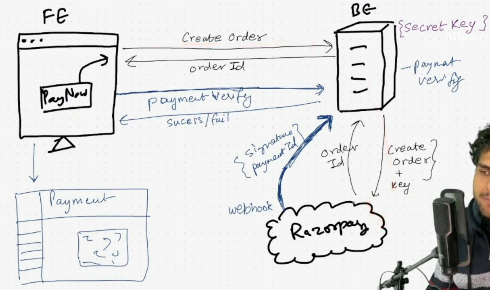

# DevTinder API

## authRouter

- POST /signup
- POST /login
- POST /logout

## profileRouter

- GET /profile/view
- PATCH /profile/edit
- PATCH /profile/password

## connectionRequestRouter

- POST /request/send/interested/:toUserId
- POST /request/send/ignored/:toUserId

_From above two apis, we can make only one api to achive same results_.

- - POST /request/send/:status/:toUserId

- POST /request/review/accepted/:requestId
- POST /request/review/rejected/:requestId

_From above two apis, we can make only one api to achive same results_.

- - POST /request/review/:status/:requestId

## userRouter

- GET /user/requests/received
- GET /user/connections
- GET /user/feed - Gets you the profile of other user on plateform

STATUS: ignored, interested, accepted, rejected

#### Pagination

Pagination is the process of dividing content into multiple pages.

MongoDB gives us two function for pagination, skip() & limit()
/feed?page=1&limit=10 => 1-10 => skip(0) limit(10)
/feed?page=2&limit=10 => 11-20 => skip(10) limit(10)
/feed?page=3&limit=10 => 21-30 => skip(20) limit(10)
/feed?page=4&limit=10 => 31-40 => skip(30) limit(10)

skip = (page-1)\*limit

# Razorpay

# Razorpay setup

- npm install razorpay
- In utils, initialize razorpay
- In routes create Order api.
- In model, create schema to store payment.
- Setup razorpay webhook on live API
- Ref - https://github.com/razorpay/razorpay-node/tree/master/documents
- Ref - https://razorpay.com/docs/payments/server-integration/nodejs/integration-steps/#integrate-with-razorpay-payment-gateway
- Ref - https://razorpay.com/docs/webhooks/validate-test/
- Ref - https://razorpay.com/docs/webhooks/payloads/payments/
